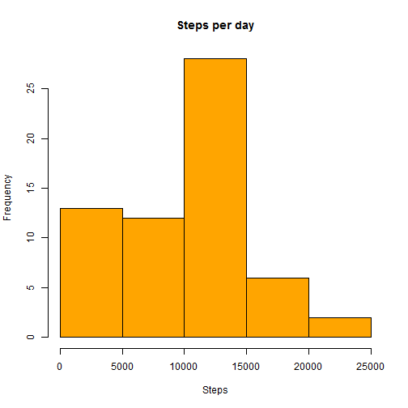
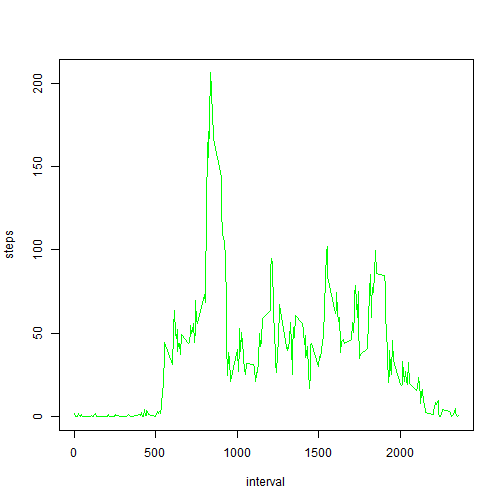
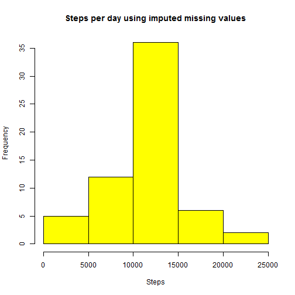
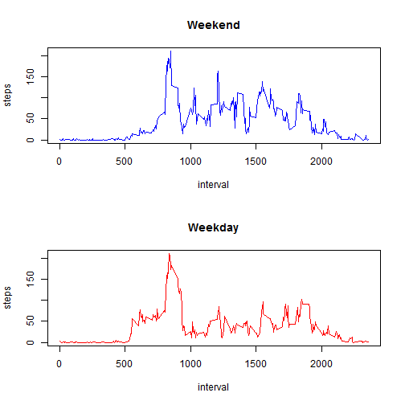

# Peer Assessment 1

Marcelo Ortiz

## Introduction

This is a peer assessment from a Coursera class called Reproducible Research. In this assessment we will be analyzing data from a personal activity monitoring device that measures the amount of steps taken every 5 minute interval. This data covers an anonymous individual personal data collected in the months of October and November of 2012.


## Loading and preprocessing the data

The first step is to load the data.

Note: If you prefer to do so you can download the data, save it on your computer and just ignore the first 3 lines of code. Otherwise you can take out the ## and run the code.


```r
##URL <- "http://d396qusza40orc.cloudfront.net/repdata%2Fdata%2Factivity.zip"
##download.file(URL, "./repr1.zip")
##unzip("repr1.zip")
dataset <- read.csv("activity.csv")
```

The next step is to look at the data to see how it is formated.


```r
str(dataset)
```

```
## 'data.frame':	17568 obs. of  3 variables:
##  $ steps   : int  NA NA NA NA NA NA NA NA NA NA ...
##  $ date    : Factor w/ 61 levels "2012-10-01","2012-10-02",..: 1 1 1 1 1 1 1 1 1 1 ...
##  $ interval: int  0 5 10 15 20 25 30 35 40 45 ...
```

After that, we have to process the data. For that, we create a list named "sum_day" that contains the sum of steps each day ignoring the missing values. These list is passed to a data frame named "datasumset" containing the day and the sum of steps in each row.


```r
sum_day <- with(dataset, tapply(steps, date, sum, na.rm = T))
datasumset <- data.frame(date = names(sum_day), steps = as.numeric(sum_day))
```

## What is mean total number of steps taken per day?

With this new data frame we will create a histogram using the base plotting system. For this part of the assignment we will ignore the missing values.


```r
hist(datasumset$steps, col = "orange", main = "Steps per day", 
  xlab = "Steps")
```

 

Next, we calculate the mean and median of our data using the code.


```r
mean(datasumset$steps)
```

```
## [1] 9354
```

```r
median(datasumset$steps)
```

```
## [1] 10395
```

## What is the average daily activity pattern?

Once we know that, we will make a different analysis.

First we will convert the date to the date class.


```r
datasumset$date <- as.Date(datasumset$date, "%Y-%m-%d")
```

Next, we make a list named "int_avg" containing the average of each interval across all days and pass it to a data frame called "dataintavg".


```r
int_avg <- with(dataset, tapply(steps, interval, mean, na.rm = T))
dataintavg <- data.frame(interval = as.numeric(names(int_avg)), 
  				steps = as.numeric(int_avg))
```

Finally we make a time series plot with the new data frame where we can appreciate the average amount of steps in each interval across all days.


```r
with(dataintavg, plot(interval, steps, type = "l",col="green"))
```

 

Then we calculate the interval that on average across all days has the maximun number of steps.


```r
dataintavg[dataintavg$steps == max(dataintavg$steps),]
```

```
##     interval steps
## 104      835 206.2
```

## Imputing missing values

For this new part of the assignment we will imput missing values to see the bias of the presence of missing values.

First we will count the amount of missing values using the complete.cases function.


```r
cases <- complete.cases(dataset)
sum(cases)
```

```
## [1] 15264
```

Then, we have to devise a strategy to fill up the missing values. We will use the interval average across the days to fill each specific interval.

For that we will use a for loop where we will check to see if there is a missing value in each row and wherever we find a missing value we will input the average of that particular interval.


```r
len <- nrow(dataset)
for(i in 1:len) {
  if(is.na(dataset[i,1])) {
		x <- dataset[i,3]
		y <- dataintavg[x == dataintavg$interval,2]
		dataset[i,1] <- y
	}
}
```

After this being done we have our data frame with all the values filled up.

We will then create a new data frame named "datasumset_2" by creating a list named "sum_day_2" that takes the sum of steps each day, using the same method as before.


```r
sum_day_2 <- with(dataset, tapply(steps, date, sum, na.rm = T))
datasumset_2 <- data.frame(date = names(sum_day_2), 
  steps = as.numeric(sum_day_2))
```

Having this, we can create a new histogram like the one we did before but this time with the missing values filled up.


```r
hist(datasumset_2$steps, col = "yellow",
     main = "Steps per day using imputed missing values", xlab = "Steps")
```

 

Next, we calculate the mean and median for the sum of steps per day using the new dataset.


```r
mean(datasumset_2$steps)
```

```
## [1] 10766
```

```r
median(datasumset_2$steps)
```

```
## [1] 10766
```

We can now make a new data frame called "Compare" containing the previous mean and median and the modified mean and median to compare them.


```r
Dataset <- c("Original","Modified")
Means <- c(mean(datasumset$steps), mean(datasumset_2$steps))
Medians <- c(median(datasumset$steps),median(datasumset_2$steps))
compare <- data.frame(Dataset,Means,Medians)
compare
```

```
##    Dataset Means Medians
## 1 Original  9354   10395
## 2 Modified 10766   10766
```

## Are there differences in activity patterns between weekdays and weekends?

After this being done we will analyze the difference between weekdays and weekend patterns.

For this we will first convert the date in the new data set to date class.


```r
dataset$date <- as.Date(dataset$date, "%Y-%m-%d")
```

We will then create a vector using the function weekday that contains the day of the week for each row.

Note: My program is in spanish therefore the names appear in spanish as well. I apologize for this. Good news is that this does not affect my analysis.


```r
week_day <- weekdays(dataset$date)
```

We create a new character vector called "weekend_weekday" where we use a for loop to check if the day is a weekday or a weekend, if it is a weekend the vector will have "weekend" in that row else it will have "weekday".


```r
weekend_weekday <- as.character(0)
for(i in 1:len) {
  if(week_day[i] == "viernes" | week_day[i] == "sabado" |
	week_day[i] == "domingo") {
		weekend_weekday[i] <- "weekend"
	}
	else {weekend_weekday[i] <- "weekday"
	}
}
```

After having this vector we simply bind it to our data set creating a new column.


```r
dataset$weekend_weekday <- weekend_weekday
```

We then make 2 data frames named "dataset_we" and "dataset_wd" by extracting weekends and weekdays.


```r
dataset_we <- dataset[(dataset$weekend_weekday == "weekend"),]
dataset_wd <- dataset[(dataset$weekend_weekday == "weekday"),]
```

To make a time series containing each interval average across the days, we need to create 2 new data frames names "dataintavg_we" and "dataintavg_wd" one for the weekends and another for the weekdays. They are created using the same method as before.


```r
int_avg_we <- with(dataset_we, tapply(steps, interval, mean, na.rm = T))
dataintavg_we <- data.frame(interval = as.numeric(names(int_avg_we)), 
  				steps = as.numeric(int_avg_we))

int_avg_wd <- with(dataset_wd, tapply(steps, interval, mean, na.rm = T))
dataintavg_wd <- data.frame(interval = as.numeric(names(int_avg_wd)), 
    			steps = as.numeric(int_avg_wd))
```

Finally we set the parameters to make two graphs. We then graph both dataframes and can clearly see the difference between weekends and weekdays for each interval average of steps.


```r
par(mfrow = c(2,1))
with(dataintavg_we, plot(interval, steps, type = "l",main = "Weekend", 
  col="blue"))
with(dataintavg_wd, plot(interval, steps, type = "l",main = "Weekday", 
	col="red"))
```

 

